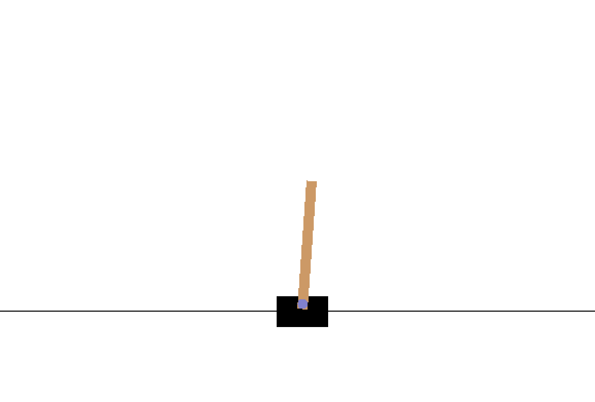

# CART-POLE

Reinforcement Learning (Deep Q-Learning) project inspired by the deeplizard tutorial.

## :dart: Objective

A pole is attached by an un-actuated joint to a cart, which moves along a frictionless track. The system is controlled by applying a force of +1 or -1 to the cart. The pendulum starts upright, and the goal is to prevent it from falling over. A reward of +1 is provided for every timestep that the pole remains upright. The episode ends when the pole is more than 15 degrees from vertical, or the cart moves more than 2.4 units from the center.

Source: https://gym.openai.com/envs/CartPole-v1/

## :rocket: How to start the game?

To download and install the dependencies (only works on macOS or Linux):
```
pip install -r requirements.txt
```
To install PyTorch on Windows: https://pytorch.org/get-started/locally/

To launch the game:
```
ipython game.py
```

## :eyes: Overview

Game:



Graphic:


Powershell's view:


